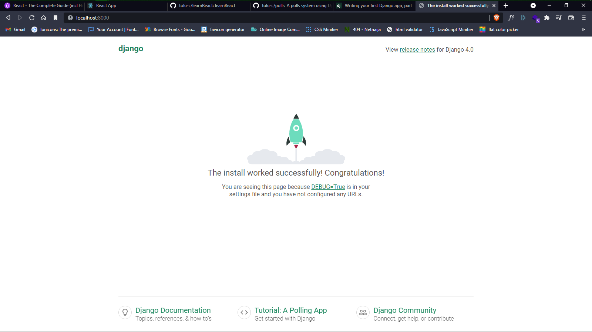

# polls

A polls system using Django

## Content

- [polls](#polls)
  - [Content](#content)
    - [Installation guide](#installation-guide)
    - [Other Info](#other-info)
    - [Screenshots](#screenshots)

### Installation guide

- Clone this repository.
- Install the required dependencies: `pip install -r requirement.txt`
- Run the server: `python manage.py runserver`
- Visit the server at port [8000](http://localhost:800)
- Visit the admin using the details provided below at [admin site](http://localhost:8000/admin)

### Other Info

- Admin Details
  
```txt
Username: admin
Email address: admin@admin.com
Password: asdf:lkj
```

### Screenshots

Installation Success

